# ToolAgent-GRPO Technical Report

## 1. Overview

ToolAgent-GRPO studies reinforcement learning for long-horizon tool-using agents in the tau-bench airline environment. The task requires an assistant to interact with a user simulator, call airline tools, track environment state, and eventually complete a realistic user request.

The project builds a complete post-training loop:

```text
72B teacher rollout
        -> trajectory filtering
        -> Qwen2.5-7B LoRA SFT
        -> veRL GRPO training
        -> multi-sample policy evaluation
```

The main focus is improving GRPO when terminal rewards are sparse and most early rollout groups fail completely.

## 2. Task Setting

The environment is tau-bench airline. Each task contains a hidden user goal and environment state. The policy must ask or answer the user, call tools, inspect tool results, and decide when the task is complete.

A trajectory contains:

- user simulator messages
- assistant responses
- tool calls
- tool results
- environment transitions
- terminal outcome reward

The project wraps 14 airline tools and supports multi-turn interaction with long context.

## 3. SFT Stage

The SFT stage trains Qwen2.5-7B with LoRA on filtered teacher trajectories. The dataset applies loss only to assistant output tokens. User messages, system context, and tool results are masked out with `IGNORE_INDEX`.

This stage gives the policy an initial ability to:

- follow airline task instructions
- emit valid assistant messages
- call domain tools
- maintain multi-turn context
- complete simple tool-use trajectories

## 4. GRPO Stage

The RL stage uses veRL GRPO with a 7B policy model and a 72B-AWQ user simulator. The training loop performs asynchronous rollout, tool execution, reward collection, and policy optimization.

Key engineering choices include:

- LoRA policy training
- FlashAttention
- gradient checkpointing
- FSDP parameter and optimizer offload
- logprob micro-batching
- vLLM GPU memory control
- separated policy and user simulator servers
- 24K context rollout support

These choices reduce memory pressure and make long multi-turn rollout more stable.

## 5. Curriculum and Judge Reward

### 5.1 Why Ordinary GRPO Is Hard Here

In long-horizon airline tasks, terminal rewards are sparse. Early in training, many rollout groups are all failures. If all samples in a GRPO group receive the same reward, the relative advantage signal becomes weak or uninformative.

This makes it hard to distinguish:

- completely wrong trajectories
- trajectories that queried useful information but missed one constraint
- trajectories that reached a near-success state but failed the final operation

### 5.2 Seen-Task Curriculum Sampling

The seen-task curriculum adjusts the training task distribution so that the model receives more useful learning signals during early and middle training. It gradually increases exposure to harder or less-covered tasks after the policy becomes more competent.

The goal is to improve:

- reward diversity inside rollout groups
- useful partial-success trajectories
- training stability under sparse rewards
- exploration efficiency on long-horizon tasks

### 5.3 Outcome-Anchored LLM-as-Judge

The outcome-anchored LLM-as-Judge mechanism keeps successful trajectories anchored by the real environment reward. For failed trajectories, it provides finer-grained process scores so that GRPO can rank failures by how close they are to success.

This gives the policy more informative relative advantages without replacing the ground-truth terminal reward for successful episodes.

## 6. Evaluation Protocol

Evaluation uses 50 tau-bench airline tasks with 4 samples per task.

Metrics are reported by split:

- `covered_seen`
- `uncovered_seen`
- `unseen`
- `overall`

Each split reports:

- number of tasks
- pass@1
- pass@4
- average turns
- average tool calls
- error rate

## 7. Main Result

| Method | Overall pass@1 | Overall pass@4 | Avg. tool calls |
|---|---:|---:|---:|
| Ordinary GRPO | 19.5% | 30.0% | 8.75 |
| Curriculum + Judge GRPO | **25.0%** | **42.0%** | **6.00** |

The curriculum + judge method improves both success rate and tool-use efficiency:

- pass@1: 19.5% -> 25.0%
- pass@4: 30.0% -> 42.0%
- average tool calls: 8.75 -> 6.00

This suggests that the trained policy not only solves more tasks, but also avoids some redundant tool calls.

## 8. Figures

The following figures are included from the local experiment artifacts. They are kept in `docs/assets/` so that the report can display the original evaluation screenshots and tables.

### Figure 1

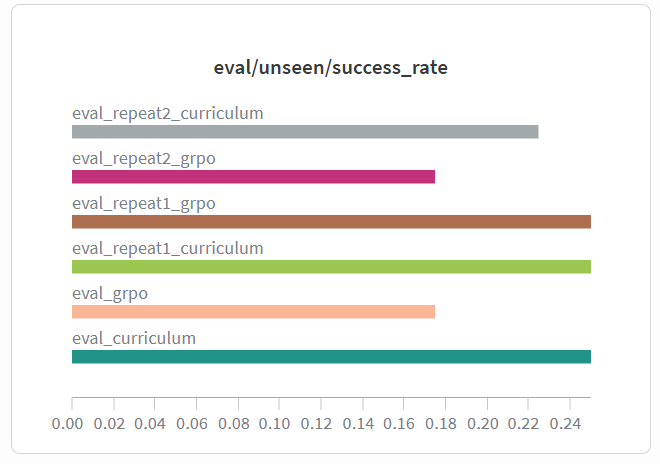

### Figure 2

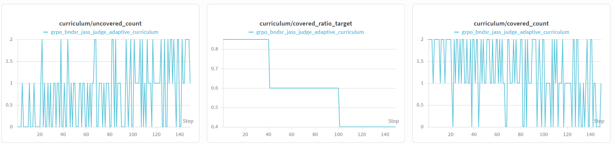

### Figure 3

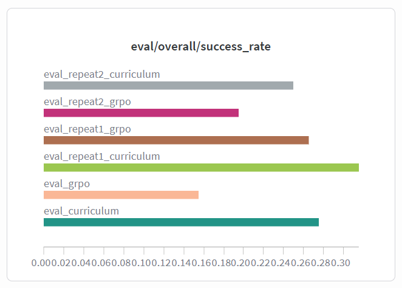

### Figure 4

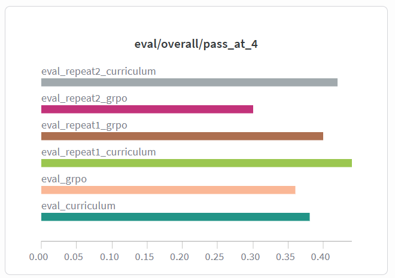

### Figure 5

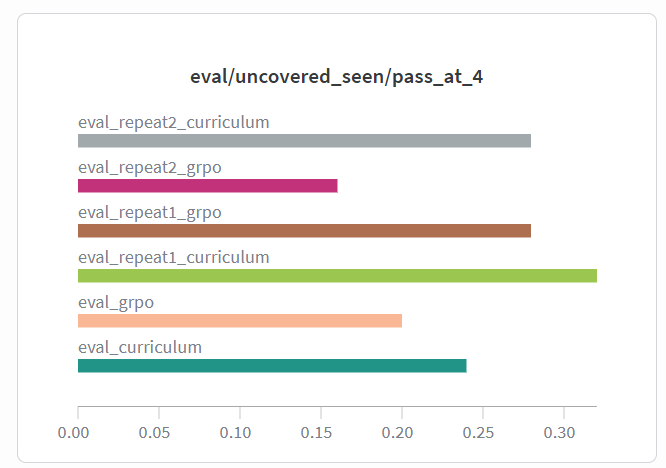

### Figure 6

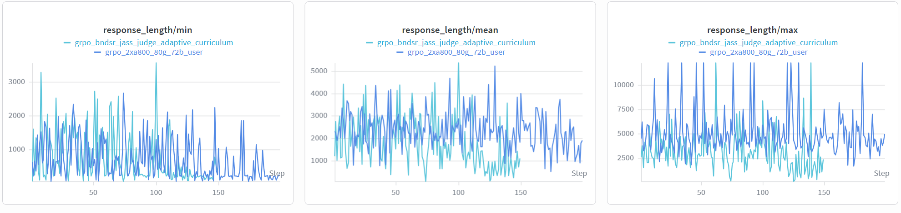

### Figure 7

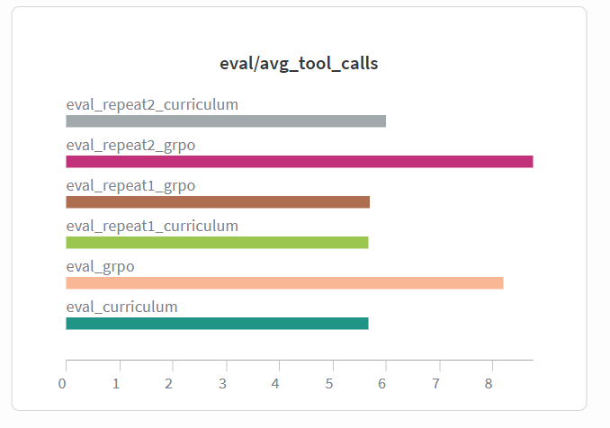

### Figure 8

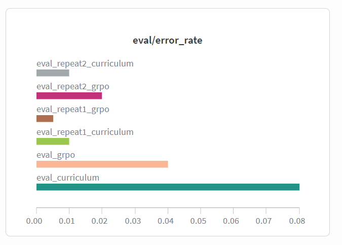

### Figure 9

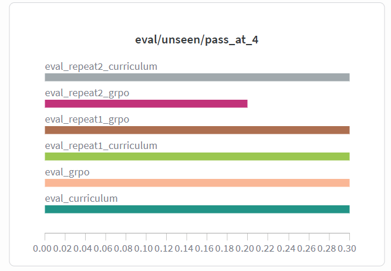

### Figure 10

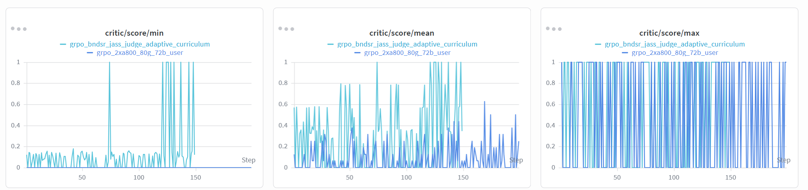

### Figure 11

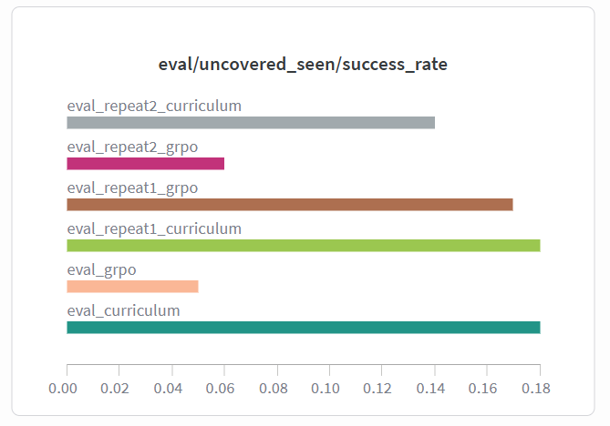

## 9. Analysis

### 9.1 Why Curriculum Helps

The curriculum improves the density of useful training signals. Uniform sampling can waste a large fraction of rollout budget on all-failed groups. Curriculum sampling makes the early distribution more learnable, then raises difficulty as the policy improves.

### 9.2 Why Judge Reward Helps

Terminal reward only tells whether the final task succeeded. It does not tell whether a failed trajectory was close to success. The outcome-anchored judge provides relative scores among failed trajectories, which helps GRPO assign more meaningful advantages.

### 9.3 Tool Efficiency

The curriculum + judge model reduces average tool calls from 8.75 to 6.00. This indicates more direct planning and less redundant tool querying.

## 10. Implementation Map

Important implementation files:

- `src/delta_critic_ledger/sft_dataset.py`: assistant-only SFT labeling.
- `src/delta_critic_ledger/verl_integration/agent_loop.py`: rollout loop for agent interaction.
- `src/delta_critic_ledger/verl_integration/interaction.py`: user, environment, and tool interaction.
- `src/delta_critic_ledger/training/b_ndsr.py`: B-NDSR related reward and advantage processing.
- `src/delta_critic_ledger/training/jass.py`: JASS sampling and scoring logic.
- `src/delta_critic_ledger/training/llm_judge.py`: LLM-as-Judge process reward for failed trajectories.

## 11. Limitations and Future Work

The current experiments focus on tau-bench airline. Future work can extend the framework to:

- additional tau-bench domains
- adaptive rollout budget allocation
- better failure-prefix reuse
- stronger process reward models
- online curriculum scheduling based on group reward diversity

## 12. Summary

ToolAgent-GRPO combines teacher rollout, LoRA SFT, veRL GRPO, tau-bench async rollout, curriculum sampling, outcome-anchored judge reward, and long-context memory optimization.

In repeat evaluation, the curriculum + judge variant improves overall pass@1 from 19.5% to 25.0%, improves pass@4 from 30.0% to 42.0%, and reduces average tool calls from 8.75 to 6.00.
